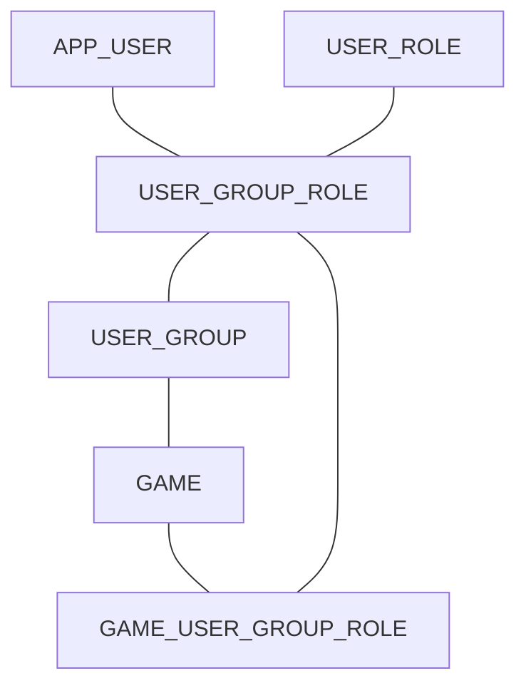
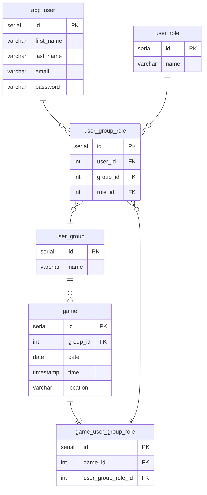

# 5 A Side Organiser

## What is the Application?

An all-in-one application for football organisers and players alike which allows all parties involved to provide and access the necessary information around the setup of a football game in one location.

## Why is this Necessary

Organising a game of football between friends should be a care free process, however this is not the case in my experience. A system reliant on on dms, group chats or even word of mouth provides so many issues for the organiser and there is little in the way of tracking or consistency. Confusion around game dates/times, who is going to the games and paying for the games are some of the biggest problems that have risen from my personal 5-a-side that could be eliminated with the correct application. So why not aim for a way to gather all the information one needs and display it in a concise and user friendly way to make organising less of a hassel and reduce confusion of the players within the group?

## Application Aims

- A single application to organise/participate in a football game
- User Role based system
- Creation/management of football groups
- A collection of involved groups
- Football game proposal, participation and setup

## MVP

- User accounts and login page
- Football group creation with user invitation
- User Roles within groups i.e. Admin, Organiser and Player
- Football game setup (dates, times, locations, no. of players etc.) by Organiser
- Football game accepting by Players
- Random team allocation

## Stretch Goals

- User game notificaions (push and/or email)
- Post game poles (Player of the Match, best goal etc.)
- Player ratings for team allocation balance
- User payment?

## Domain Model



## ERD



## API Design

### Users

`GET /users` Returns a list of all current users

Response `200 OK`

```json
[
  {
    "id": 1,
    "firstName": "Michael",
    "lastName": "Mackin",
    "email": "michaelmackin@email.com",
    "password": "ljhg3453hj4g52345h"
  },
  {
    "id": 2,
    "firstName": "Marcus",
    "lastName": "Rashford",
    "email": "mrashford@email.com",
    "password": "89adf7gasf90g8asf80a7g"
  }
]
```

`GET /user/{user-id}` Returns a user by the respective id

Response `200 OK`

```json
{
  "id": 1,
  "firstName": "Michael",
  "lastName": "Mackin",
  "email": "michaelmackin@email.com"
}
```

`POST /user` Adds a new user

Response `201 CREATED`

```json
{
  "firstName": "Lionel",
  "lastName": "Messi",
  "email": "lmessi@email.com",
  "password": "45h6g7f54h6kg7f5467"
}
```

`PUT /user/{user-id}` Updates a user by the respective id

Response `200 OK`

```json
{
  "firstName": "Lionel",
  "lastName": "Messi",
  "email": "lmessi123@email.com"
}
```

---

### Groups

`GET /groups/{user-id}` Returns a list of all groups by user id

Response `200 OK`

```json
[
  {
    "name": "Premier League"
  }
]
```

`POST /group` Adds a group

Response `201 CREATED`

```json
{
  "name": "La Liga"
}
```

`DELETE /groups/{group-id}` Deletes a group by its group id

Response `204 NO CONTENT`

---

### Games

`GET /games/{group-id}` Returns a list of all games by group id

Reponse `200 OK`

```json
[
  {
    "date": "2023-1-1",
    "time": "12:00:00",
    "location": "Old Trafford"
  },
  {
    "date": "2023-1-2",
    "time": "15:00:00",
    "location": "Anfield"
  },
  {
    "date": "2023-1-2",
    "time": "17:30:00",
    "location": "Stamford Bridge"
  }
]
```

`GET /games/{game-id}` Returns a game by the respective game

Response `200 OK`

```json
{
  "date": "2023-1-1",
  "time": "12:00:00",
  "location": "Old Trafford"
}
```

`POST /games` Adds a game

Response `201 CREATED`

```json
{
  "date": "2023-1-2",
  "time": "14:00:00",
  "location": "Ethiad"
}
```
