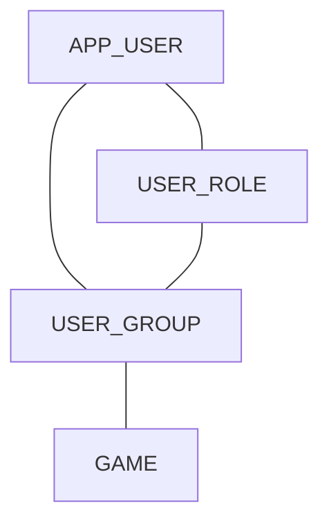
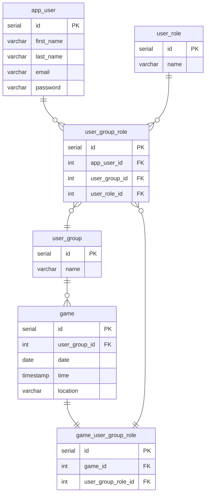

# 5 A Side Organiser

## What is the Application?

An all-in-one application for football organisers and players alike which allows all parties involved to provide and access the necessary information around the setup of a football game in one location.

## Why is this Necessary

Organising a game of football between friends should be a care free process, however this is not the case in my experience. A system reliant on on dms, group chats or even word of mouth provides so many issues for the organiser and there is little in the way of tracking or consistency. Confusion around game dates/times, who is going to the games and paying for the games are some of the biggest problems that have risen from my personal 5-a-side that could be eliminated with the correct application. So why not aim for a way to gather all the information one needs and display it in a concise and user friendly way to make organising less of a hassel and reduce confusion of the players within the group?

## Application Aims

- A single application to organise/participate in a football game
- User Role based system
- Creation/management of football groups
- A collection of involved groups
- Football game proposal, participation and setup

## Must Haves

- User accounts
- Login Page
- User Dashboard Page
- Group creation
- User Roles within groups (Admin, Organiser, Player)
- Game creation (dates, times, locations, no. of players etc.)
- Team allocation

## Should Haves

- Group invitations
- Game invitations
- Game/User association
- Random team allocation for Games

## Could Haves

- User account creation
- User Account Page
- Group/Game invitation notifications (email)
- Post Game poles (Player of the Match, best goal etc.)

## Wont Haves

- Push notifications
- User payment
- Player ratings for balancing team allocation

## Domain Model



## ERD



## API Design

### Users

`GET /users` Returns a list of all current users

Response `200 OK`

```json
[
  {
    "userId": 1,
    "firstName": "Michael",
    "lastName": "Mackin",
    "email": "michaelmackin@email.com"
  },
  {
    "userId": 2,
    "firstName": "Marcus",
    "lastName": "Rashford",
    "email": "mrashford@email.com"
  }
]
```

`GET /users/{userId}` Returns a user by the respective id

Response `200 OK`

```json
{
  "firstName": "Michael",
  "lastName": "Mackin",
  "email": "michaelmackin@email.com"
}
```

`GET /users/{userId}/groups` Returns a list of groups by user id

Response `200 OK`

```json
{
  "groups": [
    { "groupId": 1, "groupName": "Premier League" },
    { "groupId": 2, "groupName": "La Liga" },
    { "groupId": 3, "groupName": "Serie A" }
  ]
}
```

`POST /users` Adds a new user

Response `201 CREATED`

```json
{
  "firstName": "Lionel",
  "lastName": "Messi",
  "email": "lmessi@email.com"
}
```

`POST /users/{userId}/groups/{groupId}` Adds a group to a user

Response `201 CREATED`

`PUT /users/{userId}` Updates a user by the respective id

Response `200 OK`

```json
{
  "firstName": "Lionel",
  "lastName": "Messi",
  "email": "lmessi123@email.com"
}
```

`DELETE /users/{userId}` Deletes a user by its user id

Response `204 NO CONTENT`

---

### Groups

`GET /groups/{groupId}/users` Returns a list of all users within a group

Response `200 OK`

```json
{
  "users": [
    { "userId": 1, "firstName": "Marcus", "lastName": "Rashford" },
    { "userId": 2, "firstName": "Pep", "lastName": "Guardiola" },
    { "userId": 3, "firstName": "Mohamed", "lastName": "Salah" }
  ]
}
```

`GET /groups/{groupId}/games` Returns a list of all games within a group

Response `200 OK`

```json
{
  "games": [{ "gameId": 1 }, { "gameId": 2 }, { "gameId": 3 }]
}
```

`POST /groups` Adds a group

Response `201 CREATED`

```json
{
  "groupName": "La Liga"
}
```

`DELETE /groups/{groupId}` Deletes a group by its group id

Response `204 NO CONTENT`

---

### Games

`GET /games/{gameId}` Returns a game by its game id

Response `200 OK`

```json
{
  "date": "2023-1-1",
  "time": "12:00:00",
  "location": "Old Trafford"
}
```

`GET /games/{gameId}/users` Returns a list of users for a game

Response `200 OK`

```json
{
  "users": [
    { "userId": 1, "firstName": "Marcus", "lastName": "Rashford" },
    { "userId": 2, "firstName": "Pep", "lastName": "Guardiola" },
    { "userId": 3, "firstName": "Mohamed", "lastName": "Salah" }
  ]
}
```

`POST /games/{gameId}/groups/{groupId}` Adds a game for a group

Response `201 CREATED`

```json
{
  "date": "2023-1-2",
  "time": "14:00:00",
  "location": "Ethiad"
}
```

`POST /games/{gameId}/users/{userId}` Adds a user to a game

Response `201 CREATED`
